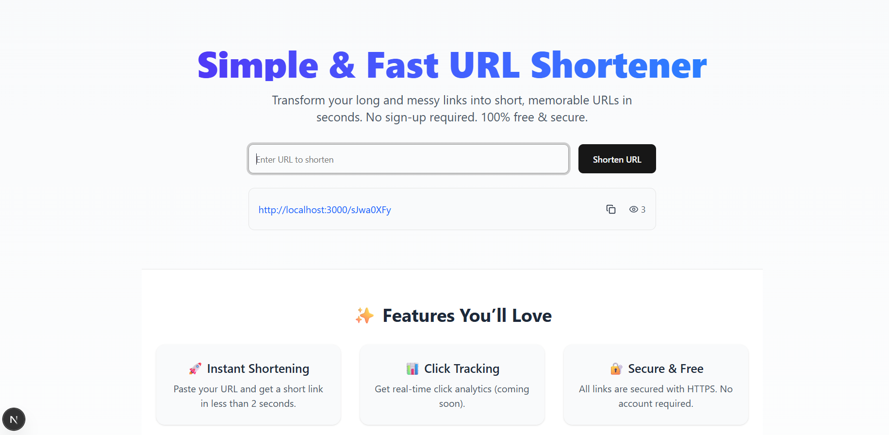

Sure! Here's a professional and clear **README.md** for your simple URL shortener project, keeping it concise and easy to understand, without mentioning ads or Bit.ly comparison:

````markdown
# Simple URL Shortener 🚀

A fast and secure URL shortening web application built with **Next.js**, **TypeScript**, and **Prisma**. This project allows users to shorten long URLs into short, easy-to-share links and track their usage.

## Features

- Shorten long URLs into short, memorable links.
- Track the number of times a URL has been visited.
- Real-time URL creation and access.
- Clean and modern UI with Tailwind CSS.
- Fully responsive design.

## Tech Stack

- **Frontend:** Next.js, React, TypeScript, Tailwind CSS  
- **Backend:** Next.js API Routes, Node.js  
- **Database:** Prisma ORM, MongoDB / PostgreSQL (configurable)  
- **Utilities:** nanoid (for unique short codes)

## Getting Started

### Prerequisites

- Node.js v18+  
- npm or yarn  
- Database (MongoDB or PostgreSQL)

### Installation

1. Clone the repository:

```bash
git clone https://github.com/Mobeenkhxn01/url-shortener.git
cd simple-url-shortener
````

2. Install dependencies:

```bash
npm install
# or
yarn install
```

3. Set up environment variables:

Create a `.env` file in the root directory:

```env
DATABASE_URL=your_database_url
NEXT_PUBLIC_BASE_URL=https://shrt-rho.vercel.app
```

4. Run Prisma migrations:

```bash
npx prisma migrate dev --name init
```

5. Start the development server:

```bash
npm run dev
# or
yarn dev
```

Open [https://shrt-rho.vercel.app](https://shrt-rho.vercel.app) to view the app.

## API Endpoints

* `POST /api/shorten` – Shortens a given URL and returns a short code.
* `GET /api/urls` – Returns a list of recently created URLs and their visit counts.
* `GET /:short` – Redirects the user to the original URL and increments the visit count.

## Usage

1. Enter a long URL in the input box on the homepage.
2. Click **Shorten URL**.
3. Copy the generated short link and share it.
4. The app tracks the number of visits for each URL.

## Screenshots



## Contributing

Contributions are welcome! Feel free to submit issues or pull requests for improvements.

## License

This project is licensed under the MIT License.

---

Made with ❤️ by [Mobeen Khan](https://github.com/Mobeenkhxn01)

```
